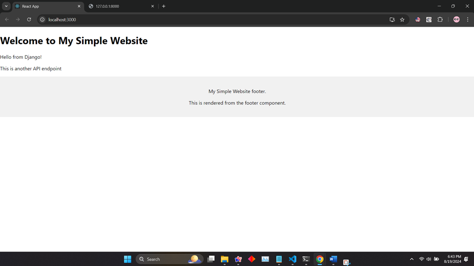
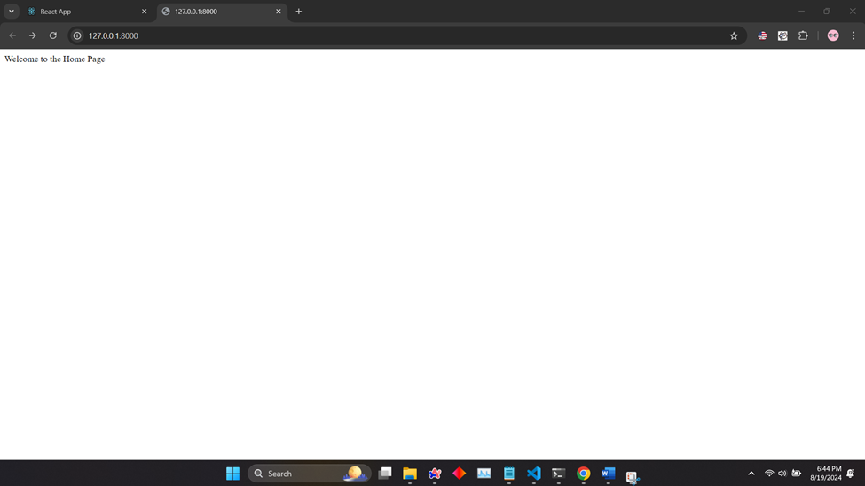
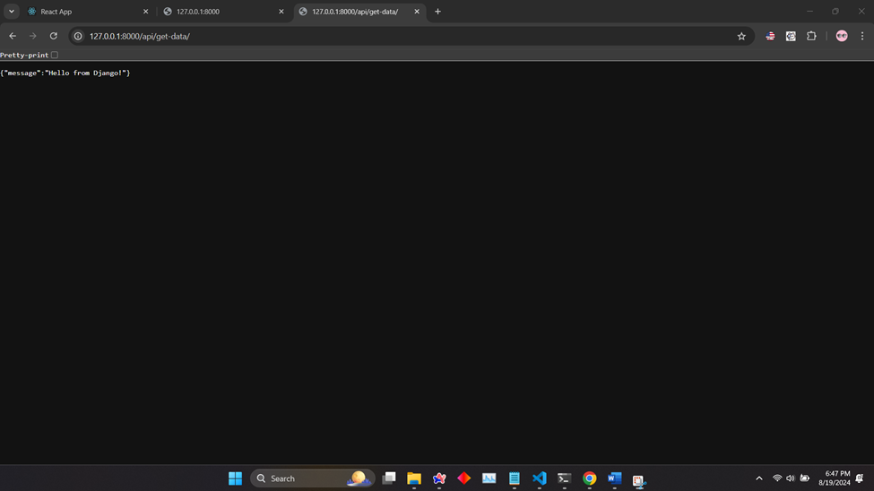
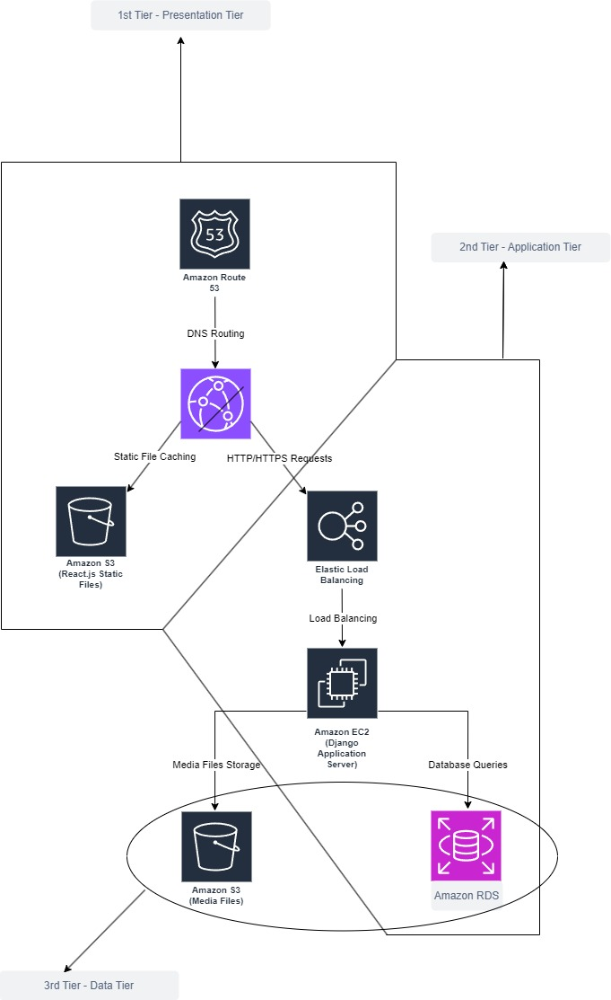

# Simple Website using Django and React.js Coding Assessment - Krishna Vamsi Kurumaddali

This project is divided into two parts which is the simultaneous implementation of **Django** and **React.js** applications.

## Prerequisites 
- **Node.js** and **npm** installed 
- **Python** installed

## Getting Started 
### 1. Setting Up the React App Open the first terminal and execute the following commands:
```bash 
 npx create-react-app simple-website
 cd simple-website
```


### 2. Setting Up the Django Backend In the second terminal, navigate to the `simple-website` directory and set up a virtual environment:
```bash 
python -m venv simweb_env
```
 - Activate the virtual environment:
```bash 
simweb_env\Scripts\activate
```
 - Install Django and `django-cors-headers`
```bash
pip install django
pip install django-cors-headers
```
- Creating Django Project
```bash
django-admin startproject simwebbackend
cd simwebbackend
```
- Starting the Django App
In the second terminal, run the following command to start the Django server:
```bash
python manage.py startapp api
```
### 3. Running the Django App Server
In the second terminal, run the following command to start the Django server:
```bash
python manage.py runserver
```
The server can be accessed by clicking the link provided in the terminal.
### 4. Running the React.js App
```bash
npm start
```
The application will automatically open in your default web browser. If not, you can Ctrl + click the link provided in the terminal to access the application.

## Ouputs Rendered
### React Application Output


### Django Application Output


## To view the information passed using API to the react application can be done as follows

- Use this url to access that as follows: 
```bash 
http://127.0.0.1:8000/api/get-data/ 
```


## AWS 3-Tire Architecture for Simple Website
### 1. Presentation Tier 
- This tier consists mostly frontend technologies like Amazon S3 for hosting **react.js** front end files like **HTML**, **CSS**, **JavaScript**.
- Amazon CloudFront for CDN (Content Delivery Network) which helps in caching react.js static files for fast accessing by globalizing.
- Amazon Route 53 helps in in routing the website domain and traffic distribution to cloudfront.

### 2. Application Tier 
- Elastic Load Balancer helps in optimizing the distribution of incoming traffic across multiple Django application servers which run on EC2 instances.
- Amazon EC2 instances host the Django backend application where there are multiple servers for scalability and redundancy.
- Amazon RDS here helps in application data storage like user credentials and so on.

### 3. Data Tier 
- Here, Amazon S3 is used to store static assets like media files and other complex data.
- Again the use of Amazon RDS is done so to manage the relational database for Django backend.

## 3-Tier AWS Architecture Flow Diagram

